# Fleetspan

**Source:** `ai-in-enterprise/Yoda_ Scaling Machine Learning @ Careem – Tech @ Careem – Medium/`
**Domain:** `ai-enterprise`
**One-liner:** A marketplace and rideshare ML scale-ops platform that takes models from dataset to dimension-scoped real-time or batch serving in hours—with city/segment rollouts, A/B routing, and drift-aware refresh—so mobility platforms can run thousands of production models across markets.
**Wedge:** Multi-city marketplace / mobility / delivery platforms that need per-dimension models (city, country, vehicle type, cohort) for ETA, matching, pricing, or ETA-like services, and today take days to ship each refresh.
**Positioning:** Marketplace ML scale ops. Generic ML platforms ignore dimension-based model fleets, booking-path latency contracts, captain/customer experience KPIs, and one-click refresh tied to marketplace A/B. Fleetspan is the operating system Careem’s Yoda narrative implies as a product.

## Market research synthesis

### Thesis from source

Careem’s engineering post on Yoda describes why a regional super-app needs **thousands of production-level ML models** across **120+ cities** spanning rides, food, and deliveries. Local optimization is mandatory; a single global model is not enough. Gap analysis produced three requirements: (1) ideation to production integration in **hours**; (2) experiment, train, and serve heterogeneous libraries in a scalable, cost-efficient way; (3) leverage offline and real-time big data sources in both training and serving—while democratizing ML across teams.

The ETA walkthrough is the canonical workflow. Customers depend on upfront ETA after booking; the ETA service sends captain coordinates, booking coordinates, OSM distance/ETA, and context to an ML API that returns a prediction. Development cycles through dataset generation, feature engineering, model selection/training, evaluation, and serving. Datasets are built via SQL/Spark, persisted with attributes including **dimension** (country, city, car type, age group—granularity of rollout). Training must allow scikit-learn, CatBoost, TensorFlow, MLlib, etc., with automatic metadata capture, resource-specified jobs, monitoring, and Airflow pipeline creation. Evaluation includes metrics, visualizations, reproducibility metadata, **benchmark datasets**, and Kaggle-like collaboration; **model drift** detection is mandatory because the business moves fast.

Serving splits into **real-time** and **batch**. Real-time: one API serves many dimension-specific models (Cairo ≠ emerging-market city); integration with an A/B framework (Galileo) by dimension; key-value features from pipelines; shared contract with production services; stateless horizontal scale; **one-click deployment** for model refresh; centralized monitoring; prediction logging/streaming for live performance. Batch: store predictions for lookup, simulation, or heavy algorithms. Outcomes claimed: development/deployment cut from **days to minutes**, higher ML engineer output, path to AutoML and specialized platforms (forecasting, anomaly).

Fleetspan turns that operating model into a product for marketplace ML orgs: dimension-scoped fleets, dataset/feature pipelines, train-eval-serve with A/B, and Ops SLAs for ETA-class endpoints.

### Buyer & economic model

- **Primary buyer:** Head of Marketplace Science / Director of ML Platform at a multi-city mobility, delivery, or two-sided marketplace company.
- **Users:** data scientists, ML engineers, marketplace product managers (ETA/matching), city ops leads, A/B platform owners, SREs on booking path.
- **Budget owner / value metric:** marketplace quality and ML platform budget. Value metric is time ideation→production, ETA error vs. baseline OSM, booking conversion/cancellation impact, and number of dimension models healthy in production.
- **Competing status quo:** one global model, manual per-city notebooks, days-long deploys, and A/B bolted on outside the ML platform.

### Domain constraints

- **Regulatory / trust / safety:** location data is highly sensitive; safety-related ETAs and matching need monitoring; city regulations may constrain data residency.
- **Data sensitivity:** user_id, captain location, booking coordinates—prediction logs are PII-rich.
- **Change-management realities:** consumer services require a stable API contract while models churn underneath; city launches need rapid dimension onboarding without rewriting services.

## Business requirements

- BR-1: Models must be trainable and servable per configurable dimensions (e.g., city, country, vehicle type) with a single consumer API that routes by request context.
- BR-2: Dataset generation jobs must label outputs with project, time, target dimension, and lineage to source tables/streams.
- BR-3: Training must support multiple libraries/frameworks in one platform without forcing a single algorithm standard.
- BR-4: Evaluation must support benchmark datasets and comparable runs so teams can collaborate like a shared leaderboard on the same problem.
- BR-5: Real-time serving must meet the booking-path latency contract and scale horizontally with a stateless API design.
- BR-6: A/B or experiment assignment must be configurable by dimension so challenger models can roll out city-by-city.
- BR-7: Feature access at serving time must support pre-aggregated and near-real-time features from a shared key-value feature plane.
- BR-8: Model refresh must be achievable via one-click/automated deployment without changing the consumer service contract.
- BR-9: Batch serving must support offline prediction materialization for simulation and high-latency algorithms.
- BR-10: Drift and live prediction performance must be monitored continuously with alerts that trigger retraining or rollback.
- BR-11: Time from approved model to production integration must be measurable in hours/minutes, with a published platform SLO.
- BR-12: Prediction logs must be streamable for monitoring while respecting retention and minimization rules for location PII.

## User stories

Canonical user stories live in sibling [USER_STORIES.md](USER_STORIES.md).

## System design

### Overview

Fleetspan orchestrates marketplace ML from dataset jobs through dimension-scoped training, evaluation, and dual serving modes. A routing layer fronts real-time APIs, selecting models by dimension and experiment assignment, enriching with feature-store lookups, and logging predictions for drift monitors. Batch jobs materialize predictions for simulation and non-latency-critical paths. The consumer contract stays stable while models and dimensions churn.

### Actors & boundaries

- **Actors:** data scientists, ML engineers, marketplace PMs, city ops, SREs, privacy, booking/ETA microservices.
- **Trust boundary:** Fleetspan controls ML lifecycle and serving; booking systems call the stable API. Raw mobility events remain in the company’s data platform; Fleetspan stores datasets, models, and minimized prediction telemetry.
- **Human-in-the-loop points:** promoting a model past benchmark gates; expanding A/B to full city traffic; approving new dimension taxonomies; privacy exceptions on log retention.

### Core capabilities

1. **Dimension registry** — cities/segments and rollout taxonomy.
2. **Dataset generation** — Spark/SQL jobs with lineage and labels.
3. **Multi-library training** — resource-specified, metadata-captured jobs.
4. **Evaluation & benchmarks** — metrics, leaderboards, reproducibility.
5. **Real-time dimension serving** — routed API, KV features, autoscaling.
6. **Experimentation bridge** — dimension-aware A/B assignment.
7. **One-click deployment** — refresh without contract change.
8. **Batch prediction** — materialize for sim and heavy models.
9. **Drift & live monitoring** — prediction streams, alerts, rollback.

### Conceptual data

- **Primary entities:** Dimension, Project, Dataset, TrainingJob, ModelRun, Benchmark, ModelArtifact, ServingEndpoint, ExperimentAssignment, FeatureLookup, PredictionLog, DriftAlert, BatchPredictionJob.
- **Critical events:** dataset materialized, training completed, benchmark submitted, model deployed, experiment started, prediction served, drift detected, rollback executed.
- **Retention / audit needs:** model/version history for city rollbacks; prediction logs short-retained or aggregated for PII; experiment decisions retained for product governance.

### Integrations (conceptual)

- **Systems of record:** mobility data lake/streams, feature KV store, Airflow, A/B platform, booking/ETA services, monitoring/alerting, object storage for artifacts.
- **Upstream signals:** GPS/booking events, OSM baselines, city launch configs.
- **Downstream actions:** ETA responses, experiment exposures, retrain triggers, ops alerts, batch prediction tables.

### High-level architecture

```mermaid
flowchart TD
    Data[Offline and realtime mobility data] --> Datasets[Dataset generation]
    Datasets --> Train[Multi-library training]
    Train --> Eval[Evaluation and benchmarks]
    Eval --> Deploy[One-click deploy]
    Deploy --> Router[Dimension and A/B router]
    Features[Feature KV store] --> Router
    Booking[Booking / ETA service] --> Router
    Router --> RT[Real-time model fleet]
    Deploy --> Batch[Batch prediction jobs]
    RT --> Logs[Prediction log stream]
    Logs --> Drift[Drift monitoring]
    Drift --> Train
```

### Success metrics

- **Leading:** median ideation-to-production time; % dimensions with fresh models inside SLO; experiment velocity per city; feature lookup p99.
- **Lagging:** ETA error vs. OSM/baseline; impact on cancellations and customer wait; models in production per city; incident rate on booking path; data-scientist throughput (models shipped/quarter).

## OpenAPI skeleton

Canonical HTTP surface lives in sibling [openapi.yaml](openapi.yaml). Summary:

- **Base path:** `/v1/...`
- **Auth:** `X-API-Key` for booking services and jobs; Bearer JWT for operators.
- **Resource groups:** Dimensions, Datasets, Training, Models, Serving, Experiments, Monitoring.
