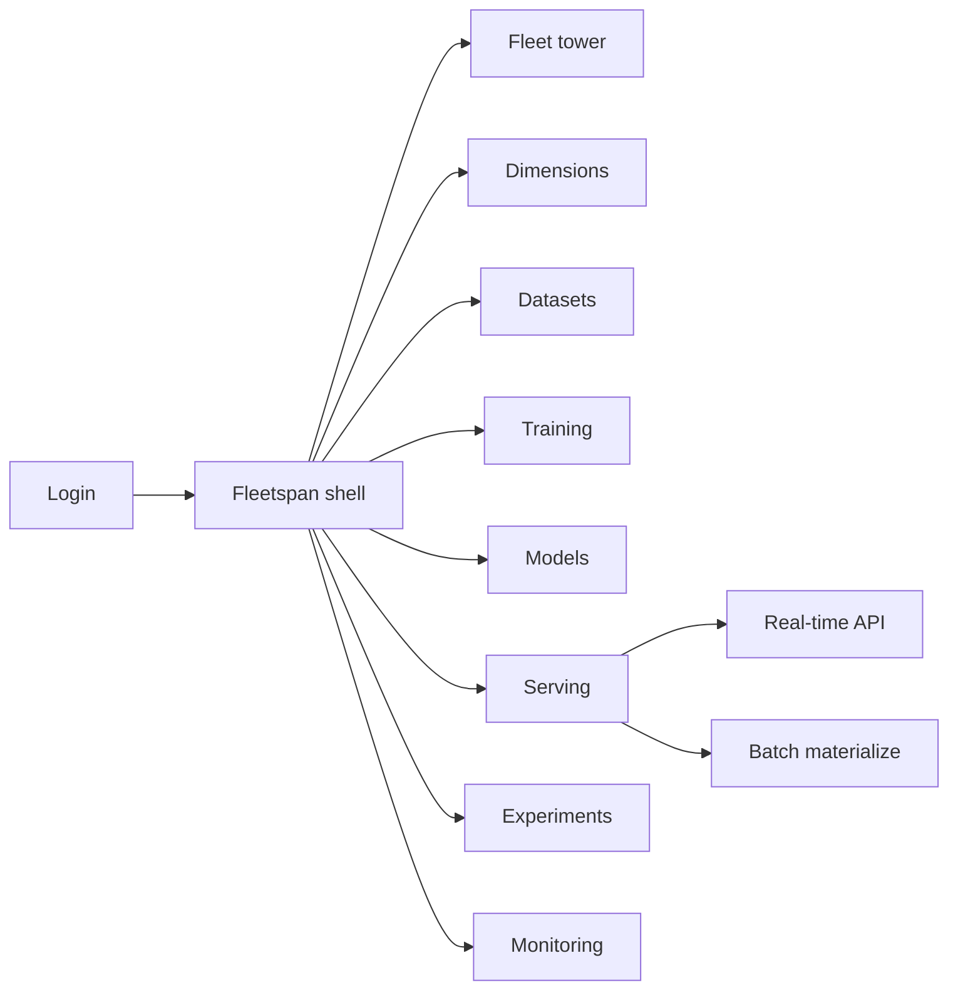
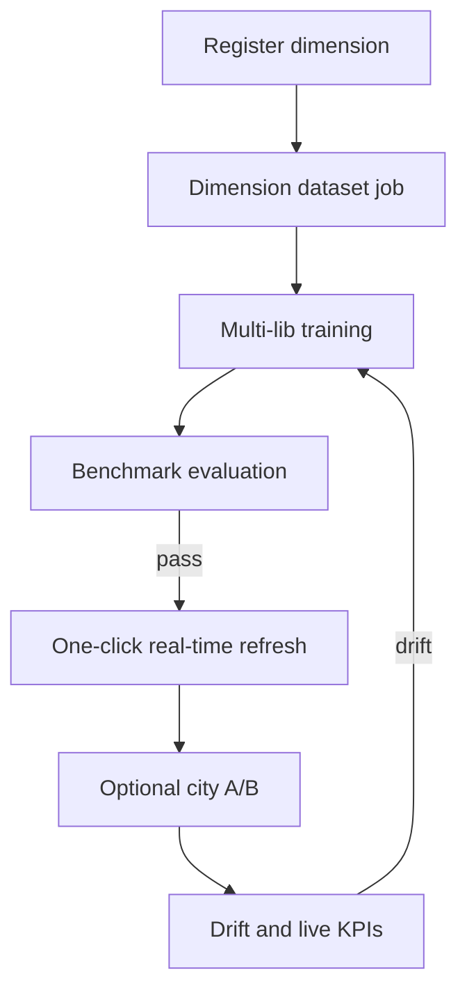

# Fleetspan — Web app

**Product:** [PRODUCT.md](./PRODUCT.md)
**Primary surface:** Marketplace ML scale-ops console (marketplace science / ML platform shell)
**Secondary surfaces:** City ops dimension health wall; booking-path SRE latency board
**Design thesis:** Fleetspan is an air-traffic control tower for thousands of dimension-scoped marketplace models — not a single global model lab. The UI metaphor is a city fleet map: Cairo ≠ emerging-market city; each dimension is a flight strip with its own model, A/B lane, and drift altimeter, while one stable consumer API is the runway contract that never moves. Visual language is night-ops navy with taxiway-green for healthy dimensions and hold-amber for drift/stale refreshes. One-click refresh feels like a clearance, not a ticket queue — ideation-to-production measured in hours, not days.

## UX research synthesis

### Category peers (best-in-class)

- **Careem/Uber/Lyft marketplace experiment platforms (Galileo-class):** Dimension-aware A/B. Steal: city-level assignment and KPI coupling (cancel, wait); reject global-only experiment defaults.
- **Vertex AI / SageMaker multi-model endpoints:** One endpoint, many models. Steal: request-context routing by dimension; reject forcing booking services to embed routing logic.
- **MLflow + Feature Store (Feast) serving UIs:** Train-eval-serve with online features. Steal: KV feature plane at serve time + prediction logging; reject days-long manual promote rituals.
- **Kaggle-like shared tasks / Weights & Biases leaderboards:** Benchmark collaboration. Steal: shared ETA benchmark datasets and comparable runs; reject private-only eval silos across city teams.

### Patterns to adopt / reject

- **Adopt:** Dimension registry; lineage-labeled dataset jobs; multi-library training; benchmark leaderboards; real-time latency contract; dimension A/B; one-click refresh; batch materialization; drift alerts; hours-scale publish SLO; PII-minimized prediction logs.
- **Reject:** One global model as default; per-city bespoke APIs; days-long deploys as normal; A/B bolted outside the ML platform; purple mobility marketing; hoarding precise coordinates in logs.

### Trust, density, and workflow constraints from PRODUCT.md

Location PII in prediction logs needs retention/minimization (BR-12). Booking-path latency is sacred (BR-5). Consumer API contract stays stable while models churn (BR-8). City onboarding must not require platform projects (BR-1). Drift triggers retrain/rollback (BR-10). Time-to-prod is a published SLO (BR-11).

## Information architecture

### Nav model

### Roles → default home

| Role | Default home | Why |
|------|--------------|-----|
| Marketplace data scientist | Datasets / Training | City-dimension sets + multi-lib train (BR-2, BR-3) |
| ML engineer / platform | Serving | One API + one-click refresh (BR-5, BR-8) |
| Marketplace PM | Experiments | City A/B vs cancel/wait KPIs (BR-6) |
| City ops | Dimensions health | Stale/drift prioritization (BR-10) |
| SRE | Serving latency board | Booking-path budgets (BR-5) |
| Privacy | Monitoring — log retention | Coordinate minimization (BR-12) |

### Cross-links to OpenAPI resources

| Nav area | OpenAPI tags / resources |
|----------|---------------------------|
| Dimension registry | Dimensions |
| Dataset jobs | Datasets |
| Training jobs | Training |
| Model registry / eval | Models |
| Real-time / batch serve | Serving |
| A/B by dimension | Experiments |
| Drift / live performance | Monitoring |

## Screen inventory

### Fleet tower (home)

- **Purpose:** Answer “which city/segment models are healthy, drifting, or blocking booking SLOs?”
- **Entry:** Default for platform / PM.
- **Layout regions:** Brand + marketplace selector; dimension fleet map/table; publish SLO (hours); latency burn; drift alerts; one-click refresh candidates.
- **Primary actions:** Open dimension; refresh model; start city A/B.
- **Empty / loading / error:** Empty = register first dimension + dataset job; loading = skeleton; error = retry with request id.
- **BR / story ties:** BR-10, BR-11.

### Dimension registry

- **Purpose:** Cities/segments/vehicle types taxonomy for rollout granularity.
- **Entry:** Nav → Dimensions; city ops onboard.
- **Layout regions:** Dimension tree; active model; experiment lane; residency notes; onboard wizard.
- **Primary actions:** Add city dimension; archive; link models.
- **Empty / loading / error:** Missing dimension on request = routing miss alert.
- **BR / story ties:** BR-1; city ops stories.

### Dataset generation

- **Purpose:** SQL/Spark jobs labeled with project, time, target dimension, lineage.
- **Entry:** Nav → Datasets.
- **Layout regions:** Job list; dimension label; lineage to tables/streams; schedule; Airflow scaffold status.
- **Primary actions:** Create job; run; promote dataset to train.
- **Empty / loading / error:** Lineage missing = cannot promote (BR-2).
- **BR / story ties:** BR-2.

### Training workspace

- **Purpose:** Multi-library jobs (sklearn, CatBoost, TF, MLlib…) with resources and metadata capture.
- **Entry:** Nav → Training.
- **Layout regions:** Framework picker; resource spec; auto metadata; pipeline scaffold; status.
- **Primary actions:** Launch train; clone; open eval.
- **Empty / loading / error:** Single-framework lock messaging never shown — all listed libs equal.
- **BR / story ties:** BR-3.

### Evaluation and benchmarks

- **Purpose:** Shared benchmark datasets and comparable runs — Kaggle-like collaboration on ETA quality.
- **Entry:** Models → Eval; benchmark hub.
- **Layout regions:** Leaderboard; benchmark dataset pins; viz; reproducibility metadata; promote gate.
- **Primary actions:** Submit run; compare; approve promote.
- **Empty / loading / error:** No benchmark attach = soft warn; regulated promote may require it.
- **BR / story ties:** BR-4.

### Real-time serving

- **Purpose:** One API routes by request context to dimension models; horizontal stateless scale; latency contract.
- **Entry:** Nav → Serving → Real-time.
- **Layout regions:** Contract docs; routing rules; feature KV status; latency SLO; scale status; one-click refresh.
- **Primary actions:** Refresh dimension model; rollback; view SDK for booking services.
- **Empty / loading / error:** Latency breach = coral hold on further rollouts.
- **BR / story ties:** BR-5, BR-7, BR-8.

### Batch serving

- **Purpose:** Materialize predictions for simulation and heavy algorithms before live traffic.
- **Entry:** Serving → Batch.
- **Layout regions:** Job config; storage target; simulation hooks; captain-experience preview note.
- **Primary actions:** Run batch; compare to live; promote insights to experiment.
- **Empty / loading / error:** Empty = suggest simulation before city-wide live.
- **BR / story ties:** BR-9.

### Experiments (dimension A/B)

- **Purpose:** Challenger rollouts city-by-city with marketplace KPIs.
- **Entry:** Nav → Experiments.
- **Layout regions:** Dimension scope; traffic split; cancel/wait/conversion metrics; expand/abort.
- **Primary actions:** Start; expand to full city; stop.
- **Empty / loading / error:** Global-only experiment = discouraged with dimension prompt.
- **BR / story ties:** BR-6.

### Monitoring and drift

- **Purpose:** Live prediction performance + drift alerts → retrain/rollback.
- **Entry:** Nav → Monitoring; tower alerts.
- **Layout regions:** Drift altimeters per dimension; live error vs OSM baseline; prediction log stream status; retention policy.
- **Primary actions:** Trigger retrain; one-click rollback; tune retention.
- **Empty / loading / error:** Healthy empty = “no drift beyond threshold.”
- **BR / story ties:** BR-10, BR-12.

### Publish SLO board

- **Purpose:** Measure approved-model → production in hours/minutes against platform SLO.
- **Entry:** Tower; platform admin.
- **Layout regions:** Lead-time distribution; breaches; bottlenecks (eval, serve refresh).
- **Primary actions:** Export; open slow path.
- **Empty / loading / error:** N/A.
- **BR / story ties:** BR-11.

## Key flows

1. **City model to booking path** — dataset for dimension → train (any lib) → benchmark eval → one-click serve refresh → monitor drift; failure: latency or benchmark gate.

2. **Onboard new city** — add dimension → seed dataset → train → serve via same API (BR-1).

3. **City A/B expand** — challenger in one city → KPI check → full traffic or abort (BR-6).

4. **Batch simulate then live** — materialize → captain/experience review → real-time refresh (BR-9).

5. **Privacy-safe logging** — stream predictions → minimize coordinates → retention enforce (BR-12).

## Design system

### Tokens (CSS variables)

- `--color-ink: #E8EEF7` — text on dark
- `--color-navy: #0A1020` — app ground
- `--color-panel: #121A2E` — panels
- `--color-rule: #2A3650` — dividers
- `--color-taxiway: #3DDC97` — healthy dimension / clear refresh
- `--color-hold: #E0A83A` — drift / stale / A/B hold
- `--color-coral: #E85D4C` — latency breach / rollback
- `--color-sky: #5B8DEF` — map/fleet accents (not purple)
- `--color-brand: #3DDC97` — Fleetspan mark on navy
- `--font-display: "Outfit", sans-serif` — tower titles
- `--font-body: "IBM Plex Sans", sans-serif` — dense ops
- `--font-mono: "IBM Plex Mono", monospace` — dimension keys, model ids
- `--space-1`…`--space-8`: 4px scale
- `--radius-sm: 4px`; `--radius-md: 8px`
- `--motion-refresh: 200ms ease-out` — one-click refresh confirm
- `--motion-drift: 260ms ease-in-out` — altimeter pulse
- `--motion-route: 220ms ease-out` — dimension route highlight
- Atmosphere: faint city-grid under fleet map; taxiway lines; no generic rideshare stock photos in console.

### Typography & brand

- Outfit for tower and city names; Plex for tables; mono for dimension keys.
- Brand in shell on serving views; login: brand + “Thousands of city models. One booking API.” + one CTA.

### Do / don’t

- **Do:** Route by dimension; keep consumer contract stable; one-click refresh; city-scoped A/B; minimize location logs; show hours-scale SLO.
- **Don’t:** Global model default; per-city API sprawl; purple mobility gradients; days-as-normal deploys; unlimited coordinate retention.

### Accessibility & domain trust cues

- Drift/latency states use text + icon + colour.
- Live regions for refresh success and SLO breach.
- Focus order: dimension → dataset → train → eval → serve → experiment → monitor.

## Component patterns

- **DimensionFleetMap** — city/segment health overview.
- **DimensionRouterBadge** — request-context → model version.
- **OneClickRefresh** — serve update without contract change.
- **BenchmarkLeaderboard** — shared ETA (or other) task runs.
- **CityExperimentLane** — A/B by dimension with marketplace KPIs.
- **DriftAltimeter** — per-dimension drift severity.
- **BookingLatencyBudget** — p99 vs contract.
- **BatchSimulatePanel** — offline predictions before live.
- **PredictionLogRetention** — PII minimization controls.
- **PublishHoursSLO** — ideation→prod lead time.

## Out of scope for v1 web

- Captain/customer mobile apps; full marketplace matching engine; OSM routing replacement; Airflow cluster admin UI; public multi-tenant SaaS for unrelated industries; native offline city-ops apps beyond health wall.
